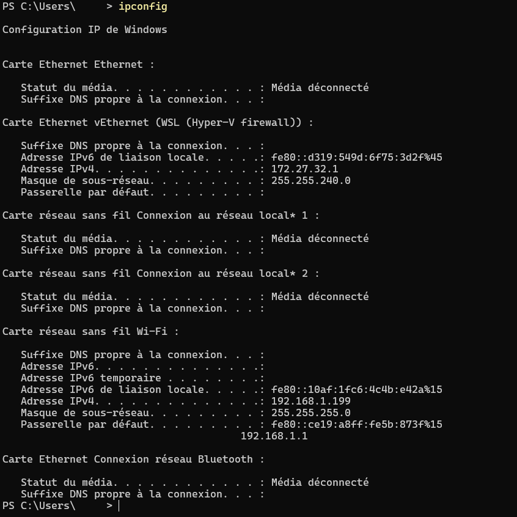

# Windows ipconfig Output

## Description

This screenshot shows the output of the `ipconfig` command on a Windows computer.

It was captured during one of my first networking lessons while learning how to identify the basic network configuration of a device.

## What this screenshot shows

- IPv4 address
- Subnet mask
- Default gateway
- Network interfaces
- Local network configuration

## Purpose

The `ipconfig` command is one of the first Windows networking tools I learned. It helps inspect the current network configuration and troubleshoot connectivity issues.

---

## Screenshot

